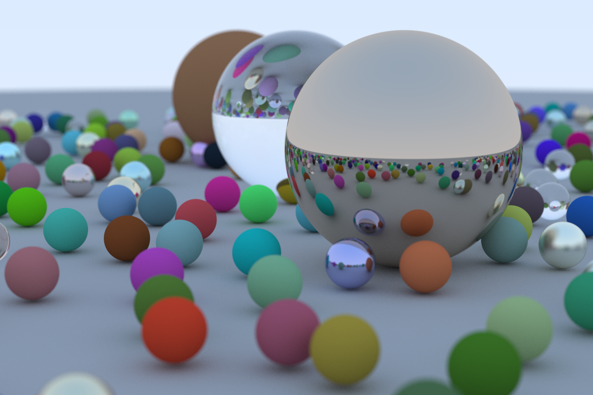

# raytracer

A Rust 2021 implementation of [Ray Tracing in One Weekend, Version 3.2.3](https://raytracing.github.io/books/RayTracingInOneWeekend.html) by [Peter Shirley](https://github.com/petershirley).



# Rendering
```
cargo run --release > final_render.ppm
```
